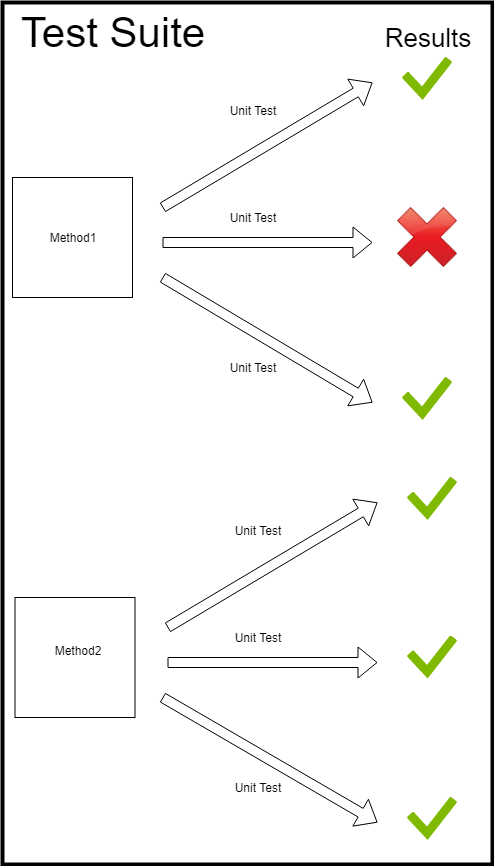
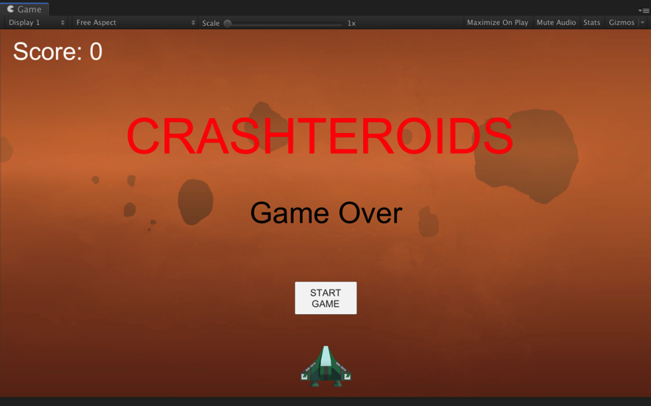
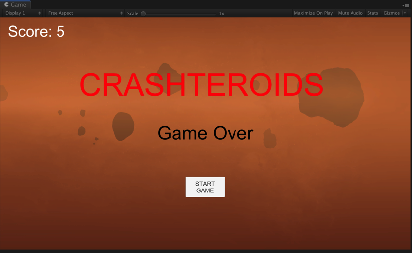

# HowToRunUnityUnitTest


## 说明

- 本文使用 *Unity Editor* 自带的单元测试工具 *Unity Test Runner* 进行单元测试。

- 本文主要是对 [raywenderlich.com](https://www.raywenderlich.com/) 中的 [Unity Tutorials](https://www.raywenderlich.com/unity) 教程 [Introduction To Unity Unit Testing](https://www.raywenderlich.com/9454-introduction-to-unity-unit-testing) 的中文翻译与补充。


## 参考

- 教程： [Introduction To Unity Unit Testing](https://www.raywenderlich.com/9454-introduction-to-unity-unit-testing)

- *Unity*官方用户手册： [Unity Test Runner](https://docs.unity3d.com/Manual/testing-editortestsrunner.html)


## 环境

- *C# 7.2*
- *Unity 2018.3*


## 项目

- [Crashteroids](https://github.com/Charon0622/HowToRunUnityUnitTest/tree/master/Crashteroids) 下的 [Crashteroids Starter](https://github.com/Charon0622/HowToRunUnityUnitTest/tree/master/Crashteroids/Crashteroids%20Starter) 为未添加测试的原始项目，供大家按照教程为项目添加测试。

- [Crashteroids](https://github.com/Charon0622/HowToRunUnityUnitTest/tree/master/Crashteroids) 下的 [Crashteroids Final](https://github.com/Charon0622/HowToRunUnityUnitTest/tree/master/Crashteroids/Crashteroids%20Final) 为按照教程添加测试后的项目。

- 也可以参考本人在学习教程时创建的项目 [Crashteroids](https://github.com/Charon0622/Crashteroids/tree/master/Crashteroids) ，里面的测试代码附有较为详细的注释。


## 教程： *Unity* 单元测试简介

### 1. 什么是单元测试？

**单元测试**是指对软件中的最小可测试单元进行检查和验证。对于单元测试中单元的含义，一般来说，要根据实际情况去判定其具体含义。总的来说，单元就是人为规定的最小的被测功能模块，单元测试应该一次只测试一个“事物”。

测试人员应该设计一个单元测试来验证一个小的逻辑代码片段是否完全按照预期执行。

请参考以下示例：

```c#
public string name = ""
public void UpdateNameWithCharacter(char: character)
{
    // 1
    if (!Char.IsLetter(character))
    {
        return;
    }

    // 2
    if (name.Length > 10)
    {
        return;
    }

    // 3
    name += character;
}
```

1. 如果 ```character``` 不是字母，则会提前退出函数，并且不会将字符添加到字符串中。
2. 如果 ```name``` 的长度大于10，则会阻止用户添加另一个字符。
3. 否则将 ```character``` 添加到 ```name``` 的结尾。

这个方法是一个可以进行单元测试的很好的例子。

#### 示例单元测试

对于 ```UpdateNameWithCharacter``` 方法，需要仔细考虑测试要进行的工作，并为它们提供名称。名称应清楚说明测试的内容：

- ```UpdateNameDoesntAllowCharacterAddingToNameIfNameIsTenOrMoreCharactersInLength```

- ```UpdateNameAllowsLettersToBeAddedToName```

- ```UpdateNameDoesntAllowNonLettersToBeAddedToName```

#### 测试套件

一个**测试套件**包含一组相关的单元测试（如战斗模块单元测试）。如果测试套件中的任何单个测试失败，则整个测试套件将失败。




### 2. 运行游戏

在 *Unity* 中打开 [Crashteroids Starter](https://github.com/Charon0622/HowToRunUnityUnitTest/tree/master/Crashteroids/Crashteroids%20Starter) 项目，然后打开 *Assets / RW / Scenes* 中的 *Game* 场景。



单击 *Play* 以启动 *Crashteroids*，然后单击 *START GAME* 按钮开始游戏。使用 ← 和 → 箭头键左右移动宇宙飞船。

按*空格键*激发激光。如果激光击中小行星，则分数将增加1。如果一颗小行星撞击船只，那么船就会爆炸并且游戏结束（可以选择重新开始）。


尝试玩一会儿，然后确保船被小行星击中以触发 *Game Over* 事件。




### 3. *Unity Test Runner* 入门

*Unity Test Runner* 是 *Unity Editor* 工具，可以在 *Play Mode*（运行模式） 和 *Editor Mode* （编译器模式）下测试代码，也可以在目标平台上测试，例如 *Standalon* ，*Android* 或 *iOS* 。

访问 *Unity Test Runner*，选择菜单栏中的 *Windows▸General▸Test Runner*。

*Unity Test Runner* 使用集成了 *Unity* 的 *NUnit* 库，这是一个基于于 *.Net* 语言的开源单元测试库。有关 *NUnit* 的更多信息，请参阅 [*NUnit* 官方网站](http://www.nunit.org/)和 [*GitHub 上*](https://github.com/nunit/docs/wiki/NUnit-Documentation)的[*NUnit* 文档](https://github.com/nunit/docs/wiki/NUnit-Documentation)。

[*UnityTestAttribute*](https://docs.unity3d.com/ScriptReference/TestTools.UnityTestAttribute.html) 是*Unity Test Runner*标准*NUnit*库的主要补充。这是一种单元测试，允许您从测试中跳过一个框架（允许后台任务完成）。使用`UnityTestAttribute`：

- 在*Play Mode*下：`UnityTestAttribute`作为 [*coroutine*](https://docs.unity3d.com/ScriptReference/Coroutine.html)执行。
- 在*Editor Mode*下：`UnityTestAttribute`在 [*EditorApplication.update*](https://docs.unity3d.com/ScriptReference/EditorApplication-update.html) 回调循环中执行。

#### *Play Mode Test* 和 *Editor Mode Test*有什么区别？

##### *Play Mode Test*

测试脚本需要：

- 已经初始化：```Awake```、```Start``` 等。
- 测试运行时：```Update```、```FixedUpdate``` 等。
- 物理。

如：

- 在访问这个对象之前是否已经初始化所有组件？
- 这个循环是否会（在给定时间内）终止？
- 将*bounciness*设置为*0.99*，球会在*X*秒后停止跳跃吗？