# HowToRunUnityUnitTest


## 说明

- 本文使用 *Unity Editor* 自带的单元测试工具 *Unity Test Runner* 进行单元测试。

- 本文主要是对 [raywenderlich.com](https://www.raywenderlich.com/) 中的 [Unity Tutorials](https://www.raywenderlich.com/unity) 教程 [Introduction To Unity Unit Testing](https://www.raywenderlich.com/9454-introduction-to-unity-unit-testing) 的中文翻译与补充。


## 参考

- 教程： [Introduction To Unity Unit Testing](https://www.raywenderlich.com/9454-introduction-to-unity-unit-testing)

- *Unity*官方用户手册： [Unity Test Runner](https://docs.unity3d.com/Manual/testing-editortestsrunner.html)


## 环境

- *C# 7.2*
- *Unity 2018.3*


## 项目

- [Crashteroids](https://github.com/Charon0622/HowToRunUnityUnitTest/tree/master/Crashteroids) 下的 [Crashteroids Starter](https://github.com/Charon0622/HowToRunUnityUnitTest/tree/master/Crashteroids/Crashteroids%20Starter) 为未添加测试的原始项目，供大家按照教程为项目添加测试。

- [Crashteroids](https://github.com/Charon0622/HowToRunUnityUnitTest/tree/master/Crashteroids) 下的 [Crashteroids Final](https://github.com/Charon0622/HowToRunUnityUnitTest/tree/master/Crashteroids/Crashteroids%20Final) 为按照教程添加测试后的项目。

- 也可以参考本人在学习教程时创建的项目 [Crashteroids](https://github.com/Charon0622/Crashteroids/tree/master/Crashteroids) ，里面的测试代码附有较为详细的注释。


## 教程： *Unity* 单元测试简介

### 1. 什么是单元测试？

**单元测试**是指对软件中的最小可测试单元进行检查和验证。对于单元测试中单元的含义，一般来说，要根据实际情况去判定其具体含义。总的来说，单元就是人为规定的最小的被测功能模块，单元测试应该一次只测试一个“事物”。

测试人员应该设计一个单元测试来验证一个小的逻辑代码片段是否完全按照预期执行。

请参考以下示例：

```c#
public string name = ""
public void UpdateNameWithCharacter(char: character)
{
    // 1
    if (!Char.IsLetter(character))
    {
        return;
    }

    // 2
    if (name.Length > 10)
    {
        return;
    }

    // 3
    name += character;
}
```

1. 如果 ```character``` 不是字母，则会提前退出函数，并且不会将字符添加到字符串中。
2. 如果 ```name``` 的长度大于10，则会阻止用户添加另一个字符。
3. 否则将 ```character``` 添加到 ```name``` 的结尾。

这个方法是一个可以进行单元测试的很好的例子。

#### 示例单元测试

对于 ```UpdateNameWithCharacter``` 方法，需要仔细考虑测试要进行的工作，并为它们提供名称。名称应清楚说明测试的内容：

- ```UpdateNameDoesntAllowCharacterAddingToNameIfNameIsTenOrMoreCharactersInLength```

- ```UpdateNameAllowsLettersToBeAddedToName```

- ```UpdateNameDoesntAllowNonLettersToBeAddedToName```

#### 测试套件

一个**测试套件**包含一组相关的单元测试（如战斗模块单元测试）。如果测试套件中的任何单个测试失败，则整个测试套件将失败。


### 2. 运行游戏

在 *Unity* 中打开 [Crashteroids Starter](https://github.com/Charon0622/HowToRunUnityUnitTest/tree/master/Crashteroids/Crashteroids%20Starter) 项目，然后打开 *Assets / RW / Scenes* 中的 *Game* 场景。


单击 *Play* 以启动 *Crashteroids*，然后单击 *START GAME* 按钮开始游戏。使用 ← 和 → 箭头键左右移动宇宙飞船。

按*空格键*激发激光。如果激光击中小行星，则分数将增加1。如果一颗小行星撞击船只，那么船就会爆炸并且游戏结束（可以选择重新开始）。


尝试玩一会儿，然后确保船被小行星击中以触发 *Game Over* 事件。


### 3. *Unity Test Runner* 入门

*Unity Test Runner* 是 *Unity Editor* 工具，可以在 *PlayMode*（运行模式） 和 *EditMode* （编辑模式）下测试代码，也可以在目标平台上测试，例如 *Standalon* ，*Android* 或 *iOS* 。

访问 *Unity Test Runner*，选择菜单栏中的 *Windows▸General▸Test Runner*。

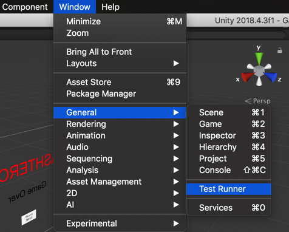

调出 *Unity Test Runner* 窗口。

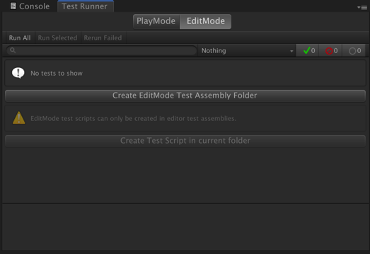

*Unity Test Runner* 使用集成了 *Unity* 的 *NUnit* 库，这是一个基于于 *.Net* 语言的开源单元测试库。有关 *NUnit* 的更多信息，请参阅 [*NUnit* 官方网站](http://www.nunit.org/)和 [*GitHub 上*](https://github.com/nunit/docs/wiki/NUnit-Documentation)的[*NUnit* 文档](https://github.com/nunit/docs/wiki/NUnit-Documentation)。

[*UnityTestAttribute*](https://docs.unity3d.com/ScriptReference/TestTools.UnityTestAttribute.html) 是*Unity Test Runner*标准*NUnit*库的主要补充。这是一种单元测试，允许您从测试中跳过一个框架（允许后台任务完成）。使用`UnityTestAttribute`：

- 在*Play Mode*下：`UnityTestAttribute`作为 [*coroutine*](https://docs.unity3d.com/ScriptReference/Coroutine.html)执行。
- 在*Editor Mode*下：`UnityTestAttribute`在 [*EditorApplication.update*](https://docs.unity3d.com/ScriptReference/EditorApplication-update.html) 回调循环中执行。

#### *PlayMode* 和 *EditMode*有什么区别？

##### *PlayMode*

测试脚本需要：

- 已经初始化：```Awake```、```Start``` 等
- 测试运行时：```Update```、```FixedUpdate``` 等
- 物理

如：

- 在访问这个对象之前是否已经初始化所有组件？
- 这个循环是否会（在给定时间内）终止？
- 将 *bounciness* 设置为 *0.99*，球会在 *X* 秒后停止跳跃吗？

##### *EditMode*

- 不需要使用 *PlayMode* （```Awake```、```Start``` 、```Update```、```FixedUpdate```、物理等）
- 明确需要在进入 *PlayMode* 之前进行的测试

如：

- 只有一个 *Camera* 在场景中吗？
- 对于 *mixed reality*：在进入 *PlayMode* 之前， *Camera* 是否处于 *0, 0, 0* 位置？
- *Camera* 是否有一个 *PhysicsRaycaster* 组件使得接口 *IPointerXxx* 工作？

对于一些使用 *EditMode* 的 *test* 来说，需要在进入 *PlayMode* 之前进行的测试，而其余 *EditorMode*下的 *test* 只是在这个模式下更快，因为在测试一些特定的东西之前不必初始化场景中的所有内容。

在本教程中只涉及 *PlayMode* 测试。

#### 设置测试文件夹

为了运行测试，首先需要创建一个测试文件夹来保存测试。

选择 *RW* 文件夹，在文件夹下面创建一个文件夹，并命名为 *Tests* 。

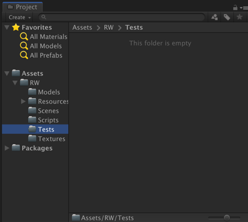

点击 *Test Runner* 窗口下的 *PlayMode* *Tab*，点击 *Create PlayMode Test Assembly Folder*，将文件夹命名为 *PlayModeTests*。

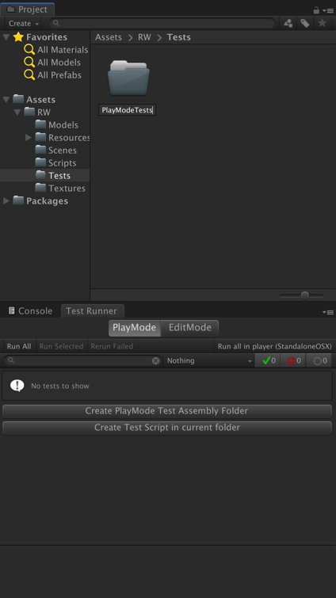

进入 *PlayModeTests* 文件夹，发现已经创建了一个名为 *PlayModeTests.asmdef* 的 *Assembly Definition* 文件。这是一个程序集定义文件，用于告诉 *Unity* 测试文件所在的位置。

如果出现 *Unity* 无法找到测试文件的情况，则应该仔细检查文件夹是否包含程序集定义文件。


#### 创建测试套件

测试套件是逻辑划分测试的地方，将测试代码划分为不同的逻辑套件（例如，物理测试套件和战斗的单独测试套件）。对于本教程，只需要一个测试套件。

点击 *Test Runner* 窗口下 *Create Test Script in current Folder*，在当前文件夹下面创建一个测试脚本，命名为 *TestSuite*。

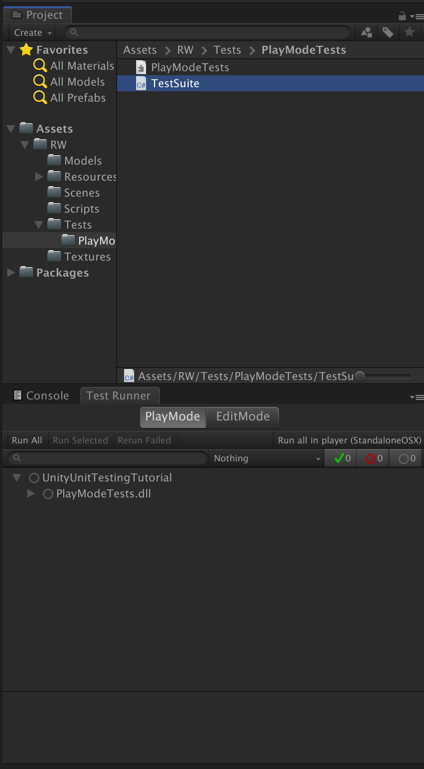

#### 设置 *Assembly Definition*

为确保测试代码可以访问游戏脚本，需要创建游戏脚本程序集定义文件并在测试程序集定义文件中设置引用。

选择 *Scripts* 文件夹，右键选择 *Create ▸ Assembly Definition*，将文件命名为 *GameAssembly*。

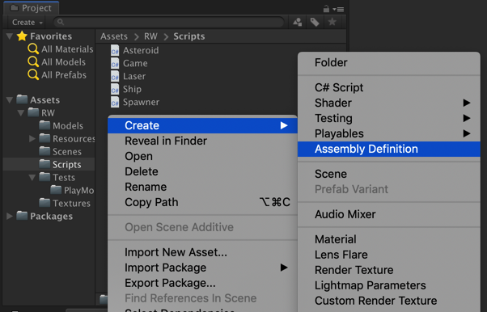

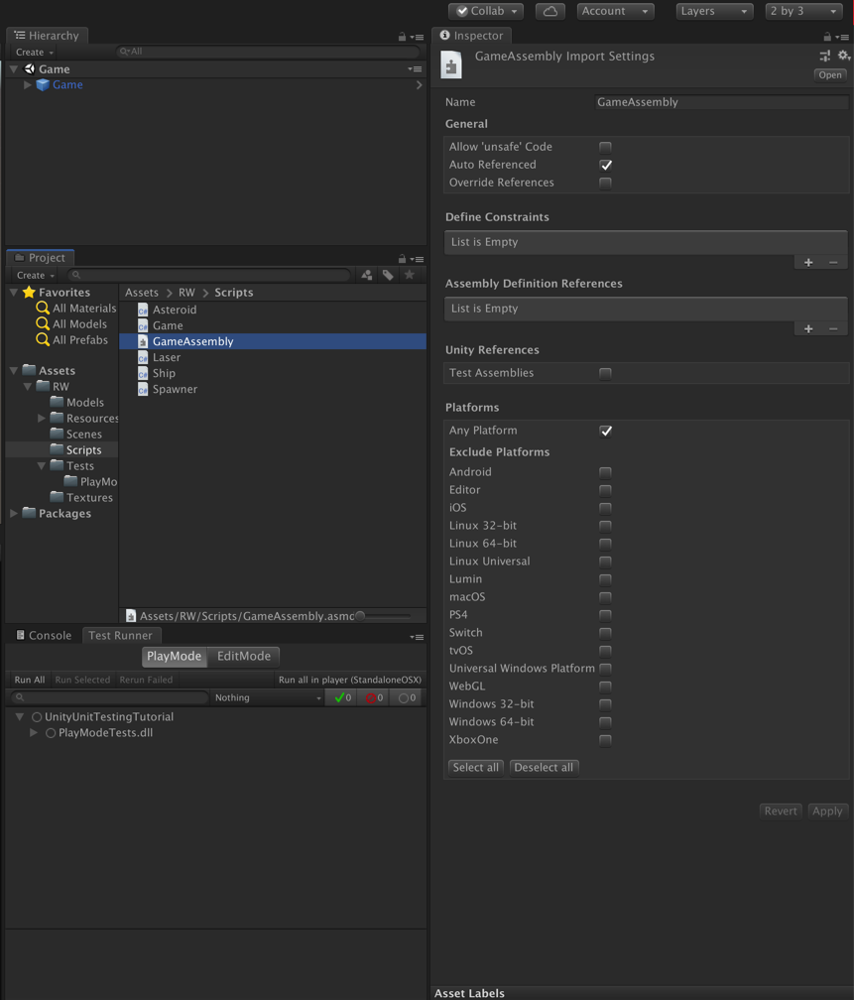

选择 *Tests / PlayMode / PlayModeTests* 测试程序集定义文件，在 *Inspector* 窗口中，单击 *Assembly Definition References* 下面的加号。


将 *Scripts* 文件夹下的 *GameAssembly* 拖到 *None(Assembly Definition Asset)* 上。

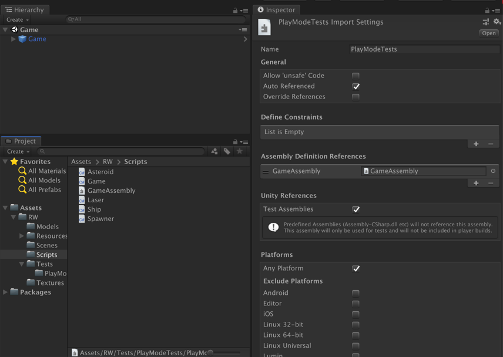

单击 *Inspector* 窗口中最下方的 *Apply* 按钮以保存这些更改。

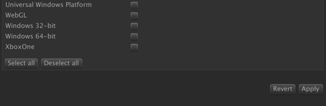

如果没有按照这些步骤操作，则无法在单元测试脚本中引用游戏脚本。


### 4. 编写第一个单元测试

在代码编辑器中打开 *TestSuite.cs* ，使用以下代码替换所有代码：

```c#
using UnityEngine;
using UnityEngine.TestTools;
using NUnit.Framework;
using System.Collections;

public class TestSuite
{

}
```

在这个小小的 *Crashteroids* 游戏中，也有很多可以编写的测试，以确保一切按预期工作。本教程只关注命中检测和核心游戏机制的几个关键领域。然而，当在生产级产品上编写单元测试时，确实需要花时间考虑测试代码所有区域所需的所有边缘情况。

#### 测试小行星向下移动

```c#
private Game game;

// This is an attribute. Attributes define special compiler behaviors. 
// It tells the Unity compiler that this is a unit test.
// This will make it appear in the Test Runner when you run your tests.
[UnityTest]
// Test the asteroids actually move down.
public IEnumerator AsteroidsMoveDown()
{
    // Use "Resources/Prefabs/Game" to create an instance of the "Game(GameObject)".
    GameObject gameGameObject = MonoBehaviour.Instantiate(Resources.Load<GameObject>("Prefabs/Game"));
  
  	// Get "Game(Script)" as a component of "Game(GameObject)".
    game = gameGameObject.GetComponent<Game>();
  
    // Get "Spawner(Script)" as a component of "Spawner(Gamebject)" in "Game(Script)" of "Game(GameObject)".
    // Use SpawnAsteroid() in Spawn class to create an astroid.
    // The astroid has Move method and be called in Update method.
    GameObject asteroid = game.GetSpawner().SpawnAsteroid();
  
    // Keep track of the initial position.
    float initialYPos = asteroid.transform.position.y;
  	
    // Add a time-step of 0.1 seconds.
    yield return new WaitForSeconds(0.1f);
  
    // This is the assertion step where you are asserting
    // that the position of the asteroid is less than the initial position (which means it moved down).
    Assert.Less(asteroid.transform.position.y, initialYPos);
  
    // It’s always critical that you clean up (delete or reset) your code after a unit test so that when the next test runs there are no artifacts that can affect that test.
    // Deleting the game object is all you have left to do, since for each test you’re creating a whole new game instance for the next test.
    Object.Destroy(game.gameObject);
}
```

##### 通过测试

在 *Test Runner* 窗口中，展开 *UnityUnitTestingTutorial* 的所有箭头，可以看到带有灰色圆圈的测试 *AsteroidsMoveDown*。

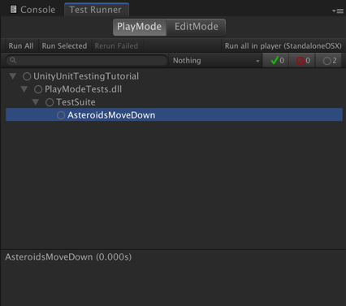

灰色圆圈表示测试尚未运行。当测试运行并通过时，它将显示绿色钩。如果测试失败，它将显示红色×。

单击 *RunAll* 按钮运行测试。编辑器将创建一个临时场景并运行测试。完成后应该显示测试通过。

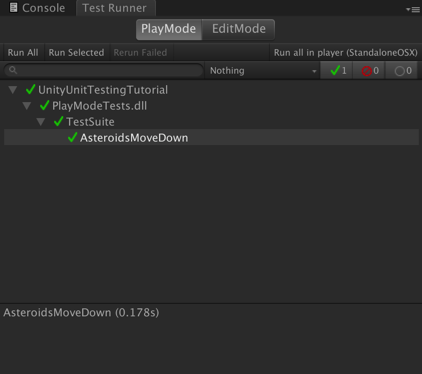

至此，第一个单元测试通过，该测试断言产生的小行星向下移动。


### 5. 将测试添加到测试套件中

#### 测试飞船撞到小行星后游戏结束

```c#
[UnityTest]
// Test game over when the ship crashes into an asteroid.
public IEnumerator GameOverOccurOnAsteroidCollision()
{
    // Use "Resources/Prefabs/Game" to create an instance of the "Game(GameObject)".
    GameObject gameGameObject = MonoBehaviour.Instantiate(Resources.Load<GameObject>("Prefabs/Game"));

    // Get "Game(Script)" as a component of "Game(GameObject)".
    game = gameGameObject.GetComponent<Game>();

    // Get "Spawner(Script)" as a component of "Spawner(Gamebject)" in "Game(Script)" of "Game(GameObject)".
    // Use SpawnAsteroid() in Spawn class to create an astroid.
    // The astroid has Move method and be called in Update method.
    GameObject asteroid = game.GetSpawner().SpawnAsteroid();

    // Set the asteroid to have the same position as the ship to make an asteroid and ship crash
    asteroid.transform.position = game.GetShip().transform.position;

    // Add a time-step to ensure the Physics engine Collision event
    yield return new WaitForSeconds(0.1f);

    // Check that the isGameOver flag in the Game script has been set to true
    Assert.True(game.isGameOver);

    // Delete the "game(GameObject)"
    Object.Destroy(game.gameObject);
}
```

#### 通过测试

查看 *Test Runner* 窗口，可以看到带有灰色圆圈的测试 *AsteroidsMoveDown*。

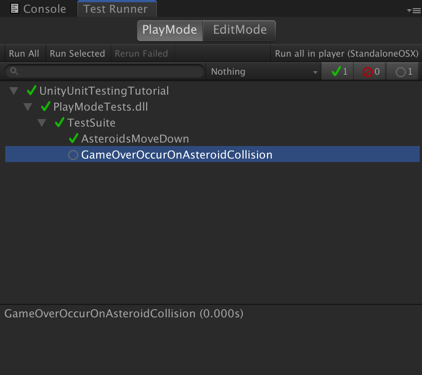

这一次，只需要运行此测试而不需要运行整个测试套件。单击 *GameOverOccursOnAsteroidCollision*，然后单击*Run Selected* 按钮。

绿色钩表明测试通过。

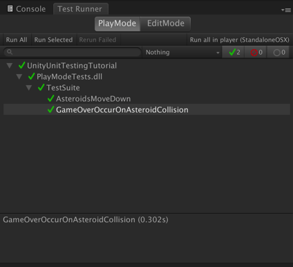

#### *Set Up* 和 *Tear Down* 属性

如上，在创建 *Game* 的 *GameObject* 以及引用Game脚本时存在一些重复代码：

```c#
GameObject gameGameObject = MonoBehaviour.Instantiate(Resources.Load<GameObject>("Prefabs/Game"));
game = gameGameObject.GetComponent<Game>();
```

以及在 *Game* 的 *GameObject* 被销毁也存在重复代码：

```c#
Object.Destroy(game.gameObject);
```

这在测试中很常见。在运行单元测试时，实际上有两个阶段：*Set Up* 和 *Tear Down*。

```Setup()```方法中的任何代码都将在该套件中的单元测试之前运行，并且```Teardown()```方法中的任何代码将在该套件中的单元测试之后运行。

打开代码编辑器，将以下代码添加到 *TestSuite* 文件的顶部，即第一个 ```[UnityTest]``` 属性的上方：

```c#
[SetUp]
public void Setup()
{
  	// Use "Resources/Prefabs/Game" to create an instance of the "Game(GameObject)".
    GameObject gameGameObject = 
        MonoBehaviour.Instantiate(Resources.Load<GameObject>("Prefabs/Game"));
  
  	// Get "Game(Script)" as a component of "Game(GameObject)".
    game = gameGameObject.GetComponent<Game>();
}
```

该`SetUp`属性指定在运行每个测试之前调用此方法。

再在该方法下面添加以下代码：

```c#
[TearDown]
public void Teardown()
{
    Object.Destroy(game.gameObject);
}
```

该`TearDown`属性指定在运行每个测试之后调用此方法。

最后删除或注释掉两个单元测试中出现的重复代码，最终如下所示：

```c#
using UnityEngine;
using UnityEngine.TestTools;
using NUnit.Framework;
using System.Collections;

public class TestSuites
{
    private Game game;

    [SetUp]
    public void Setup()
    {
        // Use "Resources/Prefabs/Game" to create an instance of the "Game(GameObject)".
        GameObject gameGameObject = MonoBehaviour.Instantiate(Resources.Load<GameObject>("Prefabs/Game"));

        // Get "Game(Script)" as a component of "Game(GameObject)".
        game = gameGameObject.GetComponent<Game>();
    }

    [TearDown]
    public void TearDown()
    {
        Object.Destroy(game.gameObject);
    }
    
    // This is an attribute. Attributes define special compiler behaviors. 
    // It tells the Unity compiler that this is a unit test.
    // This will make it appear in the Test Runner when you run your tests.
    [UnityTest]
    // Test the asteroids actually move down.
    public IEnumerator AsteroidsMoveDown()
    {
        /* // Use "Resources/Prefabs/Game" to create an instance of the "Game(GameObject)".
        GameObject gameGameObject = MonoBehaviour.Instantiate(Resources.Load<GameObject>("Prefabs/Game"));

        // Get "Game(Script)" as a component of "Game(GameObject)".
        game = gameGameObject.GetComponent<Game>(); */

        // Get "Spawner(Script)" as a component of "Spawner(Gamebject)" in "Game(Script)" of "Game(GameObject)".
        // Use SpawnAsteroid() in Spawn class to create an astroid.
        // The astroid has Move method and be called in Update method.
        GameObject asteroid = game.GetSpawner().SpawnAsteroid();

        // Keep track of the initial position.
        float initialYPos = asteroid.transform.position.y;

        // Add a time-step of 0.1 seconds.
        yield return new WaitForSeconds(0.1f);

        // This is the assertion step where you are asserting
        // that the position of the asteroid is less than the initial position (which means it moved down).
        Assert.Less(asteroid.transform.position.y, initialYPos);

        /* // It’s always critical that you clean up (delete or reset) your code after a unit test so that when the next test runs there are no artifacts that can affect that test.
        // Deleting the game object is all you have left to do, since for each test you’re creating a whole new game instance for the next test.
        Object.Destroy(game.gameObject); */
    }

    
    [UnityTest]
    // Test game over when the ship crashes into an asteroid.
    public IEnumerator GameOverOccurOnAsteroidCollision()
    {
        /* // Use "Resources/Prefabs/Game" to create an instance of the "Game(GameObject)".
        GameObject gameGameObject = MonoBehaviour.Instantiate(Resources.Load<GameObject>("Prefabs/Game"));

        // Get "Game(Script)" as a component of "Game(GameObject)".
        game = gameGameObject.GetComponent<Game>(); */

        // Get "Spawner(Script)" as a component of "Spawner(Gamebject)" in "Game(Script)" of "Game(GameObject)".
        // Use SpawnAsteroid() in Spawn class to create an astroid.
        // The astroid has Move method and be called in Update method.
        GameObject asteroid = game.GetSpawner().SpawnAsteroid();

        // Set the asteroid to have the same position as the ship to make an asteroid and ship crash
        asteroid.transform.position = game.GetShip().transform.position;

        // Add a time-step to ensure the Physics engine Collision event
        yield return new WaitForSeconds(0.1f);

        // Check that the isGameOver flag in the Game script has been set to true
        Assert.True(game.isGameOver);

       /*  // Delete the "game(GameObject)"
        Object.Destroy(game.gameObject); */
    }
```


### 6. 添加其他测试

#### 测试开始新游戏

```c#
[UnityTest]
// Test when the player clicks New Game that the gameOver bool is not true
public IEnumerator NewGameRestartGame()
{
    // Set the isGameOver to true
    game.isGameOver = true;
    // NewGame() will set this flag back to false.
    game.NewGame();

    // Assert that the isGameOver bool is false, which should be the case after a new game is called
    Assert.False(game.isGameOver);

    yield return null;
}
```

#### 测试激光摧毁小行星

```c#
[UnityTest]
// Test Lasers Destroy Asteroids
public IEnumerator LaserDestroyAsteroid()
{
    // create an asteroid
    GameObject asteroid = game.GetSpawner().SpawnAsteroid();
    // set the asteroid position
    asteroid.transform.position = Vector3.zero;

    // create a laser
    GameObject laser = game.GetShip().SpawnLaser();
    // set the laser position same as the asteroid
    laser.transform.position = Vector3.zero;

    // Add a time-step
    yield return new WaitForSeconds(0.1f);

    // Unity has a special Null class which is different from a “normal” Null class. 
    // The NUnit framework assertion Assert.IsNull() will not work for Unity null checks.
    // When checking for nulls in Unity, you must explicitly use the UnityEngine.Assertions.Assert, not the NUnit Assert.
    UnityEngine.Assertions.Assert.IsNull(asteroid);
}
```

#### 测试摧毁小行星后得分

```c#
[UnityTest]
// Test that destroying asteroids rises the score
public IEnumerator DestroyedAsteroidsRaisesScore()
{
    // create an asteroid
    GameObject asteroid = game.GetSpawner().SpawnAsteroid();
    // set the asteroid position
    asteroid.transform.position = Vector3.zero;

    // create a laser
    GameObject laser = game.GetShip().SpawnLaser();
    // set the laser position same as the asteroid
    laser.transform.position = Vector3.zero;

    // Add a time-step
    yield return new WaitForSeconds(0.1f);

    Assert.AreEqual(game.score, 1);
}
```

查看 *Test Runner* 窗口，并单击 *RunAll* 按钮运行测试。完成后显示整个测试套件中的所有测试通过。

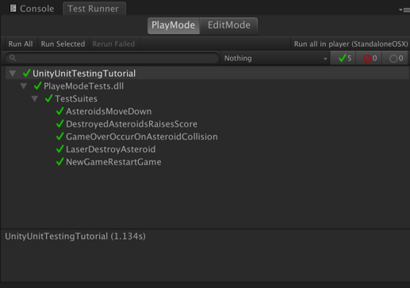


#### 7. 结尾

了哪些单元测试以及如何在Unity中编写它们后，可以考虑为 *Crashteroids* 编写更多的测试：

- 开始新游戏时分数为0
- 飞船的左右移动

等等。

